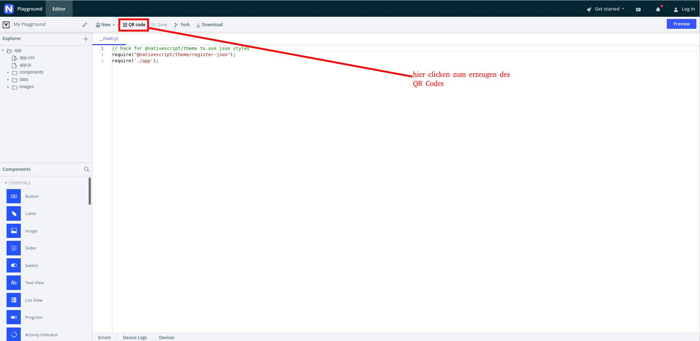

# Installation

## Preview mittels Playground App
Zum probieren und testen der App empfehlen wir die Playground App zu nutzen, da der Installationsaufwand wesentlich geringer ist, bei nahezu gleichem Nutzen.
Eine Beschreibung der Playground App und Philosophie findet sich hier [Nativescript Playground ](https://blog.nativescript.org/life-is-easier-with-nativescript-playground/)  Dafür sind folgende Schritte nötig:
1. Installation der Nativescript Playground App für [Android](https://play.google.com/store/apps/details?id=org.nativescript.play) oder für [iOS](https://apps.apple.com/us/app/nativescript-playground/id1263543946)
2. Installation der Nativescript Preview App für [Android](https://play.google.com/store/apps/details?id=org.nativescript.preview) oder für [iOS](https://apps.apple.com/us/app/nativescript-preview/id1264484702)
3. der aktuellste Stand kann dann durch Scannen des QR Codes getestet werden
[zur Playgroundpage](https://play.nativescript.org/?template=play-vue&id=H41Plp)  

 

## lokale Installation
Voraussetzungen:
[hier](https://nativescript-vue.org/en/docs/getting-started/installation/) werden die genauen Installationsschritte zum vorbereiten des Systems auf die gewünschte Kombination von Quell- und Zielsystem dargestellt.
Getestet und benutzt wurden von unserer Seite Windows + Android sowie Linux + Android. Nachdem alle in dem Dokument beschriebenen Vorbereitungen getroffen wurden Nativescript installieren  
`npm install -g nativescript`

Als nächstes das Repo klonen:

`git clone https://github.com/pigutsche/dosi_calc.git`

in den Ordner wechseln und dort in Ordner dosi_calc wechseln

`cd src/dosi_calc`

Das Smartphone im aktivierten **DEVELOPER**-Modus per USB mit dem Computer verbinden und die App mittels 

`ns run android` bzw. `ns run ios`

kompilieren und starten.

## bekannte Probleme und Lösungen
Wenn sichergestellt ist das Nativescript und alle Voraussetzungen richtig installiert wurden aber trotzdem Fehler beim starten entstehen kann es helfen mittels   `ns create`  
eine neue leere App zu installieren. Nach überprüfen das diese startet dann den Ordner App durch die den Ordner App aus dem Repo ersetzen.

