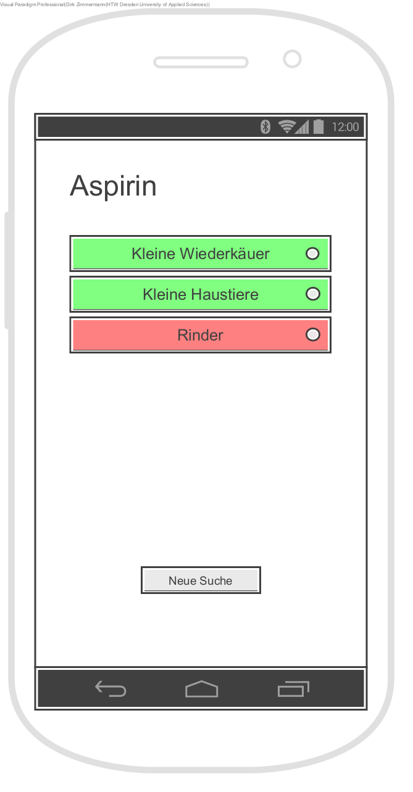

= Views
{localdatetime}
:imagesdir: images

== Übersicht

== Medikamentensuche

image::1_Medikamentensuche.png[Medikamentensuche, align="center"]

Der Nutzer kann in der Suchleiste nach einem Medikament suchen, Ergebnisse werden in einer Liste dargestellt. Neben dem Medikamentnamen können Symbole erscheinen, welche für bestimmte wichtige Zusatzinformationen stehen. Die Symbole werden in einer Legende erklärt.

== Tierauswahl

Der Nutzer wählt aus, für welche Gruppe von Tieren das Medikament angewendet werden soll. Dazu sieht er noch einmal den Namen des Medikaments und bis zu sechs Buttons mit den Gruppen, für welche es angewendet werden kann. Grün hinterlegt sind typische Anwendungen, rot nicht explizit zugelassene (umgewidmete), aber trozdem mögliche, für welche ein Formular außerhalb der Anwendung notwendig ist.

Wenn der Nutzer eine neue Suche starten will, muss er in einem Dialog bestätigen, dass er alle Eingaben löschen möchte.

== Mengenberechnung

Der Nutzer sieht den Medikamentnamen und die Tiergruppe, für die das Medikament angewendet werden soll. Er gibt in einem Textfeld das Gewicht des Tieres und wählt aus einer Verabreichungsoption aus, für die jeweils ein Infobutton daneben existiert, welcher ein Fenster mit näheren Informationen öffnet. Darunter steht die berechnete zu verabreichende Menge.

Für die ausgewählte Verabreichungsoption kann der Nutzer nähere Informationen einsehen, falls er diese benötigt.
